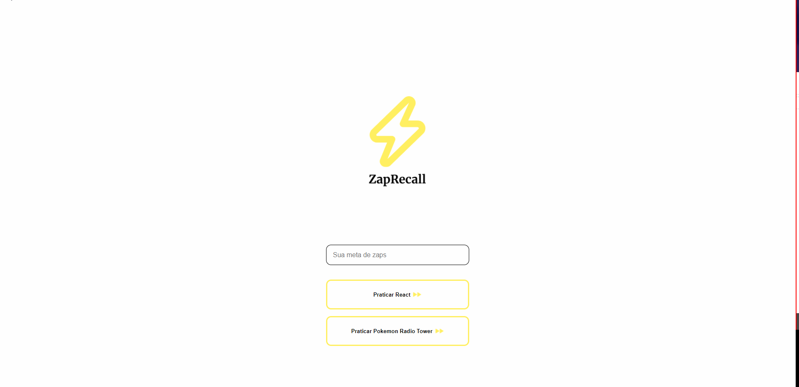

# ZapRecall

A recall card game



Demo link: https://zap-recall-puce.vercel.app/

# About

This is an web application with which people can try to remenber answers for the card questions. Below are the implemented features:

- Input Goal
- Sucess and Failure Page for beating(or not) the goal
- More than 1 deck
- Retry Button

Future features

- Deck Creation

# Technologies

The following tools and frameworks were used in the construction of the project:


<br/>
<br/>
<br/>

# How to run

1. Clone this repository
2. Install dependencies
```bash
npm i
```
3. Run with
```bash
npm start
```
